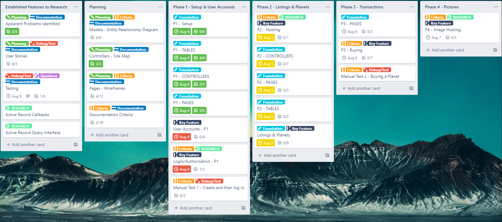

# Planet Marketplace

**Website**: https://stormy-stream-56320.herokuapp.com/
**GitHub**: https://github.com/Callum-Worrall/planet-marketplace
**Trello**: https://trello.com/b/aZBESBCJ/marketplace-app

## Purpose
The Planet Marketplace is an application that was created to demonstrate an understanding of how marketplaces are structured, it also intended to be used for entertainment and a 'fictional' application of sorts as it's real intent in its use is for amusement as it is about fictional characters trading and selling planets and will eventually have aspects of game mechanics.

## Features & Functionality
#### Current
A user can create user profiles, planets and listings. They can sell the planets using listings and buy listings they find posted by other users.

#### Future
 - Planet Resource Generation: Acquire resources via built structures that can be used for a variety of construction purposes or sold in raw bulk.
 - Army Building: Requisition armies from a planets population or buy a mercenary army.
 - Planet Claiming: Acquisition through conquering using armies, either 'unclaimed' planets or perhaps even other warlords planets.

## Target Audience - Who is the Planet Marketplace for?
Aspiring and accomplished evil alien warlords who want to buy and sell the planets they have conquered, seriously though it's got aspects that borrow from economically-based games so will be appealing to those who enjoy fictional marketplaces and enjoy empire management games.

## Tech Stack

##### Ruby on Rails
A model-view-controller framework written in Ruby for web development.

##### PostgreSQL
An object-relational database used to store the websites data.

##### HTML
The basic building block of the Web, used to define the structure of the web pages.

##### CSS & SASS
Used to alter the appearance of the websites html pages.

##### Bootstrap
Used in conjunction with CSS & SASS to alter the appearance of the website, used predominately for its'navbars', 'buttons' and 'cards'.

##### Amazon Active Storage - S3
Amazon S3 is an image upload service used to upload images to the marketplace.

##### Devise Gem for rails authentication
The Devise gem is used to validate and authenticate all interaction with a users account and profile.

##### Heroku
Heroku is used to publish the web application to the internet.

## User Stories

##### A user wants to sell a planet they have so they can earn some more credits.

- A logged in user clicks the new listing button.
- They then fill in the listing title and select they planet they want to sell, they may also add a description.
- After lastly setting a price they will publish the listing and wait.
- After a while another users purchases their listing and they receive the credits they put the listing up for and have the planet removed from their control.

##### Viewing Listings on the Home page

##### Viewing a Listing

##### Purchases

##### A user wants to buy a planet, perhaps so they can sell it later at a mark-up.

- The user searches for the type of planet they want on the listings on the home page.
- They look at several listings before settling on one they like.
- They press the purchase button and receive the planet and have the credits it cost deducted from theirs.

### Conceptual User Stories for later Updates

##### A user wants to review of a planet they bought after purchasing as they disliked the planet and they feel like the listing lied.

- A user is angry and as they have an option to leave reviews based on past purchases they decide to do so.
- In the review they leave a low rating and a comment describing their bad experience.
- The other user then replies to their rating, giving a thumbs thumbs down, saying they did not deserve the rating as they bought what was advertised.
- The user who left the review doesn't care as they have now left a bad mark against the seller of the listing.

##### A user wants to purchase and collect on investment after buying a planet.
- A user builds a facility on one of their planets to acquire resources from that planet over a period of time.

##### A user wants to claim a planet so they can sell it or use it for resources.
- A user buys an army or requisitions one from a planets population.

- They then use that army to conquer an 'unclaimed' planet.

- The invasion takes a while and their army is damaged, but eventually they  claim the planet.

  

## High-level Components

### Users and Profiles

The user-profile combination is used for everything to do with a user and their information, the user section is used solely for authentication and the profile side is used to store extra information and is the side of the users that is most interacted with. The way this works 

### Listings and Planets

Listings and planets is what the site is all about, planets are what is being sold and bought, and listings are the method of transaction. Listings can technically contain several planets, but at this point only one is possible per listing. Listings are posted by users and then bought by other users for the fictional 'credits' currency that the site uses.

### Partials

I've used several partials within the application for easier readability and to lower repetition.

#### Cards and Card Containers

Planets and listings each have their own partials for when they are being viewed in groups, for planets this is they only way they are viewed.

#### Buttons and Links

There are various buttons and links used throughout the application, they are based on bootstraps buttons, again to reduce repetition and better control across the site. Examples of buttons that have been made into partials are, new, edit and delete buttons for listings and planets.

## Entity Relationship Diagram (ERD)

### ERD - Current / Core Models

I created a more complex ERD (which I've included below this one) as I was coming up with the idea for the application, however as time proceeded I realised I needed to simplify my goals for the purpose of time management and the assessment so this 'simple' ERD resembles the project as it currently stands.

#### Core Database Relations
Discuss the database relations to be implemented.
Describe your project’s model in terms of the relationships (active record associations) they have with each other.

##### Profiles to Users

**Profiles** contain a belongs to, one-to-one foreign key to the **users** table.

##### Listings to Users
**Listings** contain a belongs to, many-to-one foreign key to the **users** table.

**Listings to Planets**

**Listings** contain a one-to-many foreign key to the **planets** table, which indicates what **planets** are included in the listing.

##### Planets to Users

**Planets** contain a many to one foreign key to the **users** table, which indicate who owns them.

### ERD - Original / Advanced Models (Outdated)

Where I would like the project to go given a larger timeframe, this ERD needs an update to indicate the new user and profile relationship.

#### Extra Database Relations

To be defined.

## Site Map - Current / Core Pages

This is a map of the site as it currently stands.

##  Site Map - Original / Advanced (Outdated)

This was the original site map that was planned alongside the original Entity Relation Diagram but was subject to advanced feature creep and was unfortunately unrealistic given the timeframe.

## Wireframes
Despite my attempts I still have not managed to alter the websites appearance to the original design of the wireframes, especially as some content like the reviews system have not made it into the project as of yet.

#### Wireframe - Navbar Logged In

#### Wireframe - Navbar Logged Out

#### Wireframe - Login Page

#### Wireframe - Sign Up Page

#### Wireframe - View Profile Page

#### Wireframe - Edit Profile Page

#### Wireframe - Home Page

In it's current state I have not yet implemented a search function and as such the home page more closely resembles the view listings wireframe below.

#### Wireframe - View Listings Page

#### Wireframe - View Listing Page

## Task Allocation and Tracking - Trello

Trello was used throughout the course of project and it was separated into 5 phases up to this point, eventually phases were archived to declutter and easier keep track of progress.
Each card in the original phases had due dates, some of these were adapted as certain tasks took longer than expected.

Below are some screenshots of several stages of the project, the documentation and research sections of the Trello board were created weeks before, with the implementation phases created later, after planning was complete.

**6th August**

**8th August**

**10th August**

**11th August**

